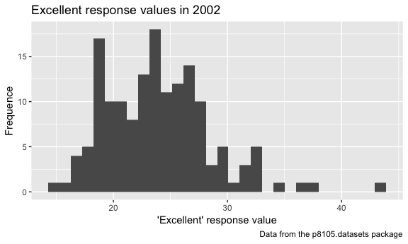
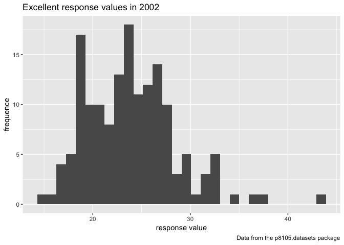

p8105\_hw2\_xy2397
================
Xue Yang
9/27/2018

Problem 1
=========

**Read and clean the data**

Retain line, station, name, station latitude / longitude, routes served, entry, vending, entrance type, and ADA compliance. Convert the entry variable from character (YES vs NO) to a logical variable.

``` r
NYC_transit_data = 
  # read the csv file through a relative path
  read_csv(file = "./data/NYC_Transit_Subway_Entrance_And_Exit_Data.csv") %>%
  
  # clean up variable names
  janitor::clean_names() %>% 
  
  # select variables following the requirement
  select(line:route11, entry, vending, entrance_type, ada) %>%
  
  # convert the variables from character to logical
  mutate(entry = ifelse(entry == "YES", TRUE, FALSE))
```

    ## Parsed with column specification:
    ## cols(
    ##   .default = col_character(),
    ##   `Station Latitude` = col_double(),
    ##   `Station Longitude` = col_double(),
    ##   Route8 = col_integer(),
    ##   Route9 = col_integer(),
    ##   Route10 = col_integer(),
    ##   Route11 = col_integer(),
    ##   ADA = col_logical(),
    ##   `Free Crossover` = col_logical(),
    ##   `Entrance Latitude` = col_double(),
    ##   `Entrance Longitude` = col_double()
    ## )

    ## See spec(...) for full column specifications.

**Short paragraph about the dataset**

This dataset "NYC\_Transit\_Subway\_Entrance\_And\_Exit\_Data" (the original dataset before cleaning) which contains information related to each entrance and exit for each subway station in NYC, contains variables: division, line, station name, station latitude, station longitude, station location (station latitude, station longitude), routes served from 1 to 11, entrance Type (stair, door, elevator, escalator or easement), entry (yes or no), entrance latitude, entrance longitude, entrance location (entrance latitude, entrance longitude), exit only (whether or not), vending (yes or no), staffing (full, none or part), staff hours, ADA (ADA compliant or not), ADA notes, free crossover (true or false), North South Street, East West Street, corner(NW, NE, SW or SE). And we are interested in the major variables such as line, station name, station latitude / longitude, routes served, entry, vending, entrance type, and ADA compliance.

I clean the data and rename the data "NYC\_transit\_data" from the following step:

-   Import data: I import the data using relative path.

-   Clean variable name: using clean\_names function from janitor package to clean up variable names and convert them to lower snake case after importing data.

-   Select variables: only retain the following variables: line, station name, station latitude / longitude, routes served, entry, vending, entrance type, and ADA compliance.

-   Covert variable: convert the entry variable from character (YES vs NO) to a logical variable (TRUE vs FALSE).

Then the dimension of dataset after cleaning "NYC\_transit\_data" is 1868 rows x 19 columns.

These data is not tidy, since the data provided includes columns "route1" to "route11", which list all routes served by a station entrance/exit, which is not a "tidy" format.

**Answer the questions using the data**

• How many distinct stations are there?

``` r
# filter the data by distinct stations
distinct_station = 
  distinct(NYC_transit_data, line, station_name, .keep_all = TRUE)

# calculate the number of distinct stations
nrow(distinct_station)
```

    ## [1] 465

So there are 465 distinct stations.

• How many stations are ADA compliant?

``` r
# filter the distinct stations that are ADA compliant
ADA_compliant =  filter(distinct_station, ada == "TRUE")

# calculate the number of ADA compliant distinct stations
nrow(ADA_compliant)
```

    ## [1] 84

So there are 84 ADA compliants in distinct stations.

• What proportion of station entrances / exits without vending allow entrance?

Since this questions ask about the station entrances/ exits, so I use the original data instead of distinct stations data to filter, since each distinct station may have some different entrances / exits.

``` r
# filter the station entrances/ exits without vending from original data
no_vending = filter(NYC_transit_data, vending == "NO")

# filter which entrances/ exits without vending that allow extrance
allow_entrance = filter(no_vending, entry == "TRUE")

# calculate the proportion
nrow(allow_entrance)/nrow(no_vending)
```

    ## [1] 0.3770492

So the proportion of station entrances / exits without vending allow entrance is 0.377.

**Reformat data and answer questions**

• How many distinct stations serve the A train?

``` r
NYC_transit_data %>% 
  
  # reformat data to distinct the route number and route name variables 
  gather(key = "route_number", value = "route_name", route1:route11) %>%
  
  # distinct the stations by line and name
  distinct(line, station_name, .keep_all = TRUE) %>% 
  
  # filter the distinct stations that serve A train
  filter(route_name == "A") %>%
  
  # calculate the number of distinct stations that serve A train
  nrow()
```

    ## [1] 60

So there are 60 distinct stations serve the A train.

• Of the stations that serve the A train, how many are ADA compliant?

``` r
NYC_transit_data %>% 
  
  # reformat data to distinct the route number and route name variables 
  gather(key = "route_number", value = "route_name", route1:route11) %>%
  
  # distinct the stations by line and name
  distinct(line, station_name, .keep_all = TRUE) %>% 
  
  # filter the distinct stations that serve A train
  filter(route_name == "A") %>% 
  
  # filter the distinct stations that serve A train that are ADA complaint
  filter(ada == "TRUE") %>% 
  
  # calculate the number of distinct stations that serve A train that are ADA complaint
  nrow()
```

    ## [1] 17

So of the stations that serve the A train, 17 of them are ADA compliant.

Problem 2
=========

**Read and clean the Mr. Trash Wheel sheet**

• specify the sheet in the Excel file and to omit columns containing notes (using the range argument and cell\_cols()function)

• use reasonable variable names

• omit rows that do not include dumpster-specific data

• rounds the number of sports balls to the nearest integer and converts the result to an integer variable (using as.integer)

``` r
Mr.Trash_Wheel_data = 
  
  # specify the sheet in the Excel file and to omit columns containing notes
  readxl::read_excel(path = "./data/HealthyHarborWaterWheelTotals2018-7-28.xlsx",
                     sheet = "Mr. Trash Wheel",
                     range = cellranger::cell_cols(c("A:N"))) %>% 
  
  # clean up variable names
  janitor::clean_names() %>% 
  
  # filter the data to omit rows that do not include dumpster data
  filter(!is.na(dumpster)) %>% 
  filter(!is.na(date))
  
# round the number of sports balls to the nearest integer
sports_balls_new = round(Mr.Trash_Wheel_data$sports_balls, digits = 0)

# convert the result to an integer variable
Mr.Trash_Wheel_data = 
  mutate(Mr.Trash_Wheel_data, sports_balls = as.integer(sports_balls_new)) 
```

**Read and clean precipitation data for 2016 and 2017**

For each, omit rows without precipitation data and add a variable year:

``` r
precipitation_2016_data = 
  
  # read the 2016 Precipitation sheet from excel file through a relative path
  readxl::read_excel(path = "./data/HealthyHarborWaterWheelTotals2018-7-28.xlsx",
                     sheet = "2016 Precipitation",
                     range = "A2:B15") %>% 
  
  # clean up variable names
  janitor::clean_names() %>% 
  
  # omit rows without precipitation data
  filter(!is.na(month)) %>% 
  
  # add a variable year
  mutate(year = "2016") 
```

``` r
precipitation_2017_data = 
  
  # read the 2017 Precipitation sheet from excel file through a relative path
  readxl::read_excel(path = "./data/HealthyHarborWaterWheelTotals2018-7-28.xlsx",
                     sheet = "2017 Precipitation",
                     range = "A2:B15") %>%
  
  # clean up variable names
  janitor::clean_names() %>% 
  
  # omit rows without precipitation data
  filter(!is.na(month)) %>% 
  
  # add a variable year
  mutate(year = "2017") 
```

**Combine datasets**

Combine datasets and convert month to a character variable:

``` r
precipitation_data = 
  
  # combine datasets 
  bind_rows(precipitation_2016_data, precipitation_2017_data) %>% 
  
  # convert month to a character variable 
  mutate(., month = month.name[month])
```

**A paragraph about these data**

The dataset comes from the HealthyHarborWaterWheelTotals2018-7-28.xlsx version.

For the Mr. Trash Wheel sheet, there are 285 observations of dumpsters. The dataset contains 14 variables, for example of key variables such as dumpster (the number of dumpster), data (year/month/day), weight(tons), volume (cubic yards), different types of trash (plastic bottles, polystyrene, cigarette butts and so on) and homes powered.

For the 2016 and 2017 precipitation sheets, each of them has 12 observations for precipitation from 12 months. The datasets contains variables including month and monthly total precipitation.

For available data, the total precipitiation in 2017 is 32.93, the median number of sports balls in a dumpster in 2016 is 26.

Problem 3
---------

**Load the data**

``` r
library(p8105.datasets)
```

**Read and clean the data**

• format the data to use appropriate variable names

• focus on the “Overall Health” topic

• exclude variables for class, topic, question, sample size, and everything from lower confidence limit to GeoLocation

• structure data so that responses (excellent to poor) are variables taking the value of Data\_value

• create a new variable showing the proportion of responses that were “Excellent” or “Very Good”

``` r
brfss = 
  
  # read the data "brfss_smart2010" from the p8105.datasets package
  brfss_smart2010 %>% 
  
  # clean up variable names
  janitor::clean_names() %>% 
  
  # filter the data to only focus on "Overall Health" topic
  filter(., topic == "Overall Health") %>% 
  
  # exclude variables for class, topic, question, sample size, and everything from lower confidence limit to GeoLocation
  select(., -class, -topic, -question, -sample_size, -(confidence_limit_low:geo_location)) %>%
  
  # spread the data so that responses (excellent to poor) are variables taking the value of data_value
  spread(key = "response", value = "data_value") %>% 
  
  # clean up variable names again
  janitor::clean_names() %>% 
  
  # create a variable that show that proportion of responses with “Excellent” or “Very Good”
  mutate(excellent_verygood_prop = (excellent + very_good)/(excellent + very_good + good + fair + poor)) 
```

**Answering the questions using this dataset**

• How many unique locations are included in the dataset? Is every state represented?

``` r
# number of unique locations in the dataset
length(unique(brfss$locationdesc))
```

    ## [1] 404

``` r
# number of unique states in the dataset
length(unique(brfss$locationabbr))
```

    ## [1] 51

There are 404 unique location included in the dataset, and every state represented, since there is totally 51 states in the US, and the unique states included in the dataset is exactly 51.

• What state is observed the most?

``` r
# table the name of the states and the frequency of each states in the dataset
table(brfss$locationabbr)
```

    ## 
    ##  AK  AL  AR  AZ  CA  CO  CT  DC  DE  FL  GA  HI  IA  ID  IL  IN  KS  KY 
    ##  11  18  21  32  52  59  47   9  27 122  27  31  14  32  25  21  38   9 
    ##  LA  MA  MD  ME  MI  MN  MO  MS  MT  NC  ND  NE  NH  NJ  NM  NV  NY  OH 
    ##  45  79  90  31  34  33  25  23  18 115  18  53  48 146  43  18  65  59 
    ##  OK  OR  PA  RI  SC  SD  TN  TX  UT  VA  VT  WA  WI  WV  WY 
    ##  40  33  59  38  63  18  26  71  50   4  48  97   9   9  22

``` r
# calculate the maximum frequency of the states in the dataset
max(table(brfss$locationabbr))
```

    ## [1] 146

So from the results we calculated for the maximum frequency of the states in the dataset, we can figure out that NJ is the state that observed the most.

• In 2002, what is the median of the “Excellent” response value?

``` r
# filter the data for year 2002
brfss_2002 = filter(brfss, year == "2002", !is.na(excellent))

# calculate the median of excellent
median(brfss_2002$excellent)
```

    ## [1] 23.6

So the median of the “Excellent” response value in 2002 is 23.6.

• Make a histogram of “Excellent” response values in the year 2002.

``` r
# use ggplot to plot the histogram of “Excellent” response values in the year 2002
ggplot(brfss_2002, aes(x = excellent)) +
  geom_histogram() +
  labs(
    title = "Excellent response values in 2002",
    x = "'Excellent' response value",
    y = "Frequence",
    caption = "Data from the p8105.datasets package"
  ) 
```

    ## `stat_bin()` using `bins = 30`. Pick better value with `binwidth`.



• Make a scatterplot showing the proportion of “Excellent” response values in New York County and Queens County (both in NY State) in each year from 2002 to 2010.

``` r
brfss %>% 
  
  # filter the data in New York County and Queens County
  filter(locationdesc %in% c("NY - New York County", "NY - Queens County")) %>% 
  
  # create a new variable to show the proportion of “Excellent” response values
  mutate(excellent_prop = (excellent)/(excellent + very_good + good + fair + poor))  %>% 
  
  # use ggplot to draw the scatterplot 
  ggplot(aes(x = year, y = excellent_prop , color = locationdesc )) +
  geom_point(alpha = 0.5) +
  labs(
    title = "Proportion of Excellent response values from 2002 to 2010",
    x = "Year",
    y = "Proportion of 'Excellent' response values ",
    caption = "Data from the p8105.datasets package"
  ) +
scale_color_hue(
    name = "Location",
  ) +
  theme(legend.position = "bottom")
```


