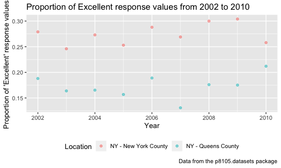
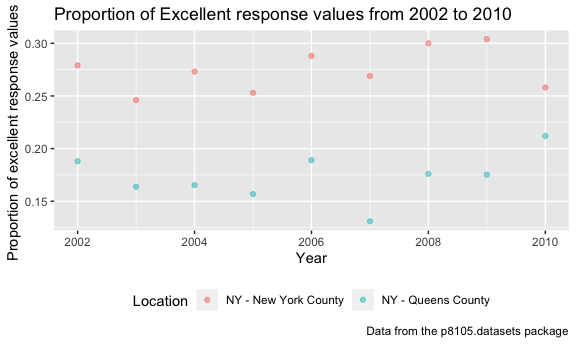

p8105\_hw2\_xy2397
================
Xue Yang
9/27/2018

Problem 1
=========

**Read and clean the data**

``` r
NYC_transit_data = 
  read_csv(file = "./data/NYC_Transit_Subway_Entrance_And_Exit_Data.csv") %>% 
  janitor::clean_names() %>% 
  select(line:route11, entry, vending, entrance_type, ada) %>%
  mutate(entry = ifelse(entry == "YES", TRUE, FALSE))
```

    ## Parsed with column specification:
    ## cols(
    ##   .default = col_character(),
    ##   `Station Latitude` = col_double(),
    ##   `Station Longitude` = col_double(),
    ##   Route8 = col_integer(),
    ##   Route9 = col_integer(),
    ##   Route10 = col_integer(),
    ##   Route11 = col_integer(),
    ##   ADA = col_logical(),
    ##   `Free Crossover` = col_logical(),
    ##   `Entrance Latitude` = col_double(),
    ##   `Entrance Longitude` = col_double()
    ## )

    ## See spec(...) for full column specifications.

**Short paragraph about the dataset**

This dataset "NYC\_Transit\_Subway\_Entrance\_And\_Exit\_Data" (the original dataset before cleaning) contains variables: Division, Line, Station Name, Station Latitude, Station Longitude, Station Location (Station Latitude, Station Longitude), Route from 1 to 11, Entrance Type (stair, door, elevator, escalator or easement), Entry (yes or no), Entrance Latitude, Entrance Longitude, Entrance Location (Entrance Latitude, Entrance Longitude), Exit Only (whether or not), Vending (yes or no), Staffing (full, none or part), Staff Hours, ADA (ADA compliant or not), ADA Notes, Free Crossover (true or false), North South Street, East West Street, Corner(NW,NE, SW or SE).

I clean the data and rename the data "NYC\_transit\_data" from the following step:

-   Import data: I import the data using relative path.

-   Clean variable name: using clean\_names() function from janitor package to clean up variable names and convert them to lower snake case after importing data

-   Select variables: only retain the following variables: line, station name, station latitude / longitude, routes served, entry, vending, entrance type, and ADA compliance.

-   Covert variable: convert the entry variable from character (YES vs NO) to a logical variable (TRUE vs FALSE).

Then the dimension of dataset after cleaning "NYC\_transit\_data" is 1868 rows x 19 columns.

These data is not tidy, since the data provided includes columns "route1" to "route11", which list all routes served by a station entrance/exit, which is not a "tidy" format.

**Answer the questions using the data**

• How many distinct stations are there? Note that stations are identified both by name and by line (e.g. 125th St A/B/C/D; 125st 1; 125st 4/5); the distinct function may be useful here.

``` r
distinct_station = 
  distinct(NYC_transit_data, line, station_name, .keep_all = TRUE)

nrow(distinct_station)
```

    ## [1] 465

• How many stations are ADA compliant?

``` r
ADA_compliant =  filter(distinct_station, ada == "TRUE")

nrow(ADA_compliant)
```

    ## [1] 84

• What proportion of station entrances / exits without vending allow entrance?

``` r
no_vending = filter(distinct_station, vending == "NO")

nrow(no_vending)/nrow(distinct_station)
```

    ## [1] 0.01935484

Reformat data so that route number and route name are distinct variables. How many distinct stations serve the A train? Of the stations that serve the A train, how many are ADA compliant?

``` r
NYC_transit_data %>% 
  gather(key = "route_number", value = "route_name", route1:route11) %>% 
  distinct(station_name, .keep_all = TRUE) %>% 
  filter(route_name == "A") %>% 
  nrow()
```

    ## [1] 48

``` r
NYC_transit_data %>% 
  gather(key = "route_number", value = "route_name", route1:route11) %>% 
  distinct(station_name, .keep_all = TRUE) %>% 
  filter(route_name == "A") %>% 
  filter(ada == "TRUE") %>% 
  nrow()
```

    ## [1] 10

Problem 2
=========

**Read and clean the Mr. Trash Wheel sheet**

• specify the sheet in the Excel file and to omit columns containing notes (using the range argument and cell\_cols()function) • use reasonable variable names • omit rows that do not include dumpster-specific data • rounds the number of sports balls to the nearest integer and converts the result to an integer variable (using as.integer)

``` r
Mr.Trash_Wheel_data = 
  readxl::read_excel(path = "./data/HealthyHarborWaterWheelTotals2017-9-26.xlsx",
                     sheet = "Mr. Trash Wheel",
                     range = cellranger::cell_cols(c("A:N"))) %>% 
  janitor::clean_names() %>% 
  filter(!is.na(dumpster)) %>% 
  mutate(., sports_balls = as.integer(sports_balls)) 
```

**Read and clean precipitation data for 2016 and 2017**

For each, omit rows without precipitation data and add a variable year. Next, combine datasets and convert month to a character variable (the variable month.name is built into R and should be useful).

``` r
precipitation_2016_data = 
  readxl::read_excel(path = "./data/HealthyHarborWaterWheelTotals2017-9-26.xlsx",
                     sheet = "2016 Precipitation",
                     range = "A2:B15") %>% 
  janitor::clean_names() %>% 
  filter(!is.na(month)) %>% 
  mutate(year = "2016")
```

``` r
precipitation_2017_data = 
  readxl::read_excel(path = "./data/HealthyHarborWaterWheelTotals2017-9-26.xlsx",
                     sheet = "2017 Precipitation",
                     range = "A2:B15") %>% 
  janitor::clean_names() %>% 
  filter(!is.na(month)) %>% 
  mutate(year = "2017") 
```

``` r
precipitation_data = 
  bind_rows(precipitation_2016_data, precipitation_2017_data) %>% 
  mutate(., month = month.name[month])
precipitation_data 
```

    ## # A tibble: 24 x 3
    ##    month     total year 
    ##    <chr>     <dbl> <chr>
    ##  1 January    3.23 2016 
    ##  2 February   5.32 2016 
    ##  3 March      2.24 2016 
    ##  4 April      1.78 2016 
    ##  5 May        5.19 2016 
    ##  6 June       3.2  2016 
    ##  7 July       6.09 2016 
    ##  8 August     3.96 2016 
    ##  9 September  4.53 2016 
    ## 10 October    0.62 2016 
    ## # ... with 14 more rows

**A paragraph about these data**

you are encouraged to use inline R. Be sure to note the number of observations in both resulting datasets, and give examples of key variables. For available data, what was the total precipitation in 2017? What was the median number of sports balls in a dumpster in 2016?

From the Mr. Trash Wheel sheet, there are 215 observations of dumpsters. The dataset contains variables including month, year, data, weight(tons), volume (cubic yards), plastic bottles, polystyrene, cigarette butts, glass Bottles, grocery bags, chip bags, sports balls and homes powered.

From the 2016 and 2017 precipitation sheets, there are 12 and 8 observations respectively. The datasets contains variables including month and monthly total precipitation.

For available data, the total precipitiation in 2017 is 29.93, the median number of sports balls in a dumpster in 2016 is 26

Problem 3
---------

**Load the data**

``` r
library(p8105.datasets)
```

**Read and clean the data**

For this question: • format the data to use appropriate variable names; • focus on the “Overall Health” topic • exclude variables for class, topic, question, sample size, and everything from lower confidence limit to GeoLocation • structure data so that responses (excellent to poor) are variables taking the value of Data\_value • create a new variable showing the proportion of responses that were “Excellent” or “Very Good”

``` r
brfss = 
  brfss_smart2010 %>% 
  janitor::clean_names() %>% 
  filter(., topic == "Overall Health") %>% 
  select(., -class, -topic, -question, -sample_size, -(confidence_limit_low:geo_location)) %>%
  spread(key = "response", value = "data_value") %>% 
  janitor::clean_names() %>% 
  mutate(excellent_verygood_proportion = (excellent + very_good)/(excellent + very_good + good + fair + poor)) 
```

Using this dataset, do or answer the following:

• How many unique locations are included in the dataset? Is every state represented? What state is observed the most?

``` r
length(unique(brfss$locationdesc))
```

    ## [1] 404

``` r
length(unique(brfss$locationabbr))
```

    ## [1] 51

There are 404 unique location included in the dataset, and every state represented, since there is totally 51 states in the US, and the unique states included in the dataset is exactly 51.

``` r
table(brfss$locationabbr)
```

    ## 
    ##  AK  AL  AR  AZ  CA  CO  CT  DC  DE  FL  GA  HI  IA  ID  IL  IN  KS  KY 
    ##  11  18  21  32  52  59  47   9  27 122  27  31  14  32  25  21  38   9 
    ##  LA  MA  MD  ME  MI  MN  MO  MS  MT  NC  ND  NE  NH  NJ  NM  NV  NY  OH 
    ##  45  79  90  31  34  33  25  23  18 115  18  53  48 146  43  18  65  59 
    ##  OK  OR  PA  RI  SC  SD  TN  TX  UT  VA  VT  WA  WI  WV  WY 
    ##  40  33  59  38  63  18  26  71  50   4  48  97   9   9  22

``` r
max(table(brfss$locationabbr))
```

    ## [1] 146

NJ is observed the most.

• In 2002, what is the median of the “Excellent” response value?

``` r
brfss_2002 = filter(brfss, year == "2002", !is.na(excellent))

median(brfss_2002$excellent)
```

    ## [1] 23.6

• Make a histogram of “Excellent” response values in the year 2002.

``` r
ggplot(brfss_2002, aes(x = excellent)) +
  geom_histogram() +
  labs(
    title = "Excellent response values in 2002",
    x = "response value",
    y = "frequence",
    caption = "Data from the p8105.datasets package"
  )
```

    ## `stat_bin()` using `bins = 30`. Pick better value with `binwidth`.



• Make a scatterplot showing the proportion of “Excellent” response values in New York County and Queens County (both in NY State) in each year from 2002 to 2010.

``` r
brfss_NY = 
  brfss %>% 
  filter(locationdesc %in% c("NY - New York County", "NY - Queens County")) %>% 
  mutate(excellent_prop = (excellent)/(excellent + very_good + good + fair + poor)) 

ggplot(brfss_NY, aes(x = year, y = excellent_prop , color = locationdesc )) +
  geom_point() +
  labs(
    title = "Proportion of Excellent response values from 2002 to 2010",
    x = "Year",
    y = "Proportion of excellent response values ",
    caption = "Data from the p8105.datasets package"
  ) +
  
  theme(legend.position = "bottom")
```


